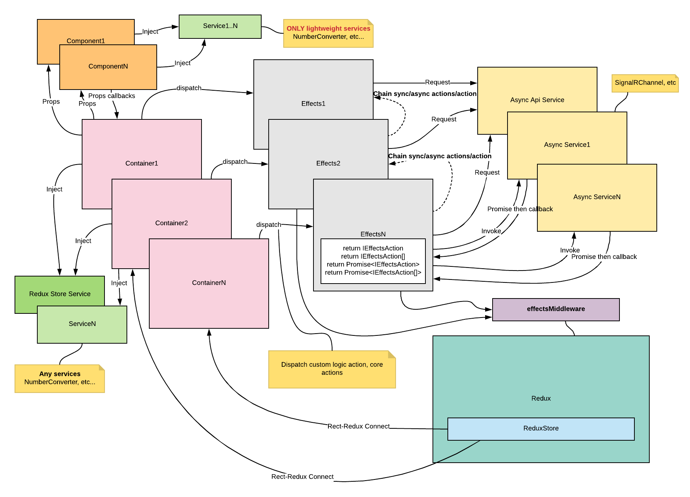

# React Application Core

A react-based application core for the business applications.

[](https://travis-ci.org/apoterenko/react-application-core)

# Flow



# Description

The library is designed to quickly start develop the business applications are based on React, Redux, Material-UI.

# Demo

* [react-redux-typescript-webpack-seed](https://github.com/apoterenko/react-redux-typescript-webpack-seed)
* [Live demo](https://apoterenko.github.io/react-redux-typescript-webpack-seed)

# Dependencies

* [react](https://github.com/facebook/react)
* [redux](https://github.com/reactjs/redux)
* [react-redux](https://github.com/reactjs/react-redux)
* [react-router-dom](https://github.com/ReactTraining/react-router)
* [material-components-web](https://github.com/material-components/material-components-web)
* [ramda](https://github.com/ramda/ramda)
* [InversifyJS](https://github.com/inversify/InversifyJS)
* [@dagrejs/graphlib](https://github.com/dagrejs/graphlib)
* [moment](https://github.com/moment/moment)
* [axios](https://github.com/axios/axios)
* [store](https://github.com/marcuswestin/store.js)
* [socket.io-client](https://github.com/socketio/socket.io-client)
* [react-text-mask](https://github.com/text-mask/text-mask)

# Classes & markers

#### @action-builder

* [PageToolbarActionBuilder](src/core/action/page-toolbar-action.builder.ts)

#### @component-container-impl

* [FilterFormDialogContainer - 09.05.2020](src/core/component/dialog/filter-form-dialog/filter-form-dialog.container.tsx)
* [FormContainer - 09.05.2020](src/core/component/form/form.container.tsx)
* [PageToolbarContainer](src/core/component/toolbar/page/page-toolbar.container.tsx)
* [SearchToolbarContainer](src/core/component/toolbar/search/search-toolbar.container.tsx)

#### @component-impl

* [PageToolbar](src/core/component/toolbar/page/page-toolbar.component.tsx)
* [SearchToolbar](src/core/component/toolbar/search/search-toolbar.component.tsx)

#### @effects-proxy-factory

* [makeDestroyedContainerEffectsProxy](src/core/store/effects/destroyed-container-effects.proxy.ts)
* [makeFilteredListEffectsProxy](src/core/store/effects/filtered-list-effects.proxy.ts)

#### @reducer

* [formReducer](src/core/component/form/form.reducer.ts)
* [queryFilterReducer](src/core/component/filter/query-filter.reducer.ts)

# Usage

#### Containers

###### Roles container

```typescript
import * as React from 'react';

import {
  listWrapperMapper,
  filterWrapperMapper,
  defaultMappers,
  BaseContainer,
  DefaultLayoutContainer,
  ListContainer,
  ContainerVisibilityTypeEnum,
  actionsDisabledListWrapperEntityMapper,
  connector,
  SearchFieldToolbarContainer,
} from 'react-application-core';

import { ROUTER_PATHS } from '../../app.routes';
import { IRolesContainerProps, ROLES_SECTION } from './roles.interface';
import { IAppState } from '../../app.interface';
import { AccessConfigT, IRoleEntity } from '../permission.interface';
import { AppPermissions } from '../../app.permissions';

@connector<IAppState, AccessConfigT>({
  routeConfiguration: {
    type: ContainerVisibilityTypeEnum.PRIVATE,
    path: ROUTER_PATHS.ROLES,
  },
  accessConfiguration: [AppPermissions.ROLES_VIEW],
  mappers: [
    ...defaultMappers,
    (state) => filterWrapperMapper(state.roles),
    (state) => listWrapperMapper(state.roles)
  ],
})
class RolesContainer extends BaseContainer<IRolesContainerProps> {

  public static defaultProps: IRolesContainerProps = {
    sectionName: ROLES_SECTION,
  };

  public render(): JSX.Element {
    const props = this.props;
    const header = <SearchFieldToolbarContainer filterConfiguration={actionsDisabledListWrapperEntityMapper(props)}
                                               {...props}/>;
    return (
      <DefaultLayoutContainer headerConfiguration={{ items: header }}
                              {...props}>
        <ListContainer listConfiguration={{
                        itemConfiguration: { tpl: this.tpl },
                        useAddAction: this.permissionService.isAccessible(AppPermissions.ROLE_ADD),
                       }}
                       {...props}/>
      </DefaultLayoutContainer>
    );
  }

  private tpl = (item: IRoleEntity): JSX.Element => (
    <span>
       {item.name} {this.nc.id(item.id)}
    </span>
  )
}
```

###### Role container

```typescript
import * as React from 'react';

import {
  BaseContainer,
  FormContainer,
  FormDialog,
  TextField,
  toSelectOptions,
  FORM_DIALOG_REF,
  listWrapperSelectedEntityMapper,
  formMapper,
  DefaultLayoutContainer,
  defaultMappers,
  ChipsField,
  ContainerVisibilityTypeEnum,
  connector,
  LayoutBuilder,
  LayoutBuilderTypeEnum,
} from 'react-application-core';

import { IRoleContainerProps, ROLE_SECTION } from './role.interface';
import { IAppState } from '../../../app.interface';
import { RIGHTS_DICTIONARY } from '../../../dictionary';
import { ROUTER_PATHS } from '../../../app.routes';
import { AccessConfigT } from '../../permission.interface';
import { AppPermissions } from '../../../app.permissions';

@connector<IAppState, AccessConfigT>({
  routeConfiguration: {
    type: ContainerVisibilityTypeEnum.PRIVATE,
    path: ROUTER_PATHS.ROLE,
  },
  accessConfiguration: [AppPermissions.ROLE_VIEW],
  mappers: [
    ...defaultMappers,
    (state) => formMapper(state.roles.role),
    (state) => listWrapperSelectedEntityMapper(state.roles, state.roles.role)
  ],
})
class RoleContainer extends BaseContainer<IRoleContainerProps> {

  public static defaultProps: IRoleContainerProps = {
    sectionName: ROLE_SECTION,
  };

  private readonly layoutBuilder = new LayoutBuilder();

  public render(): JSX.Element {
    const props = this.props;
    const dictionaries = props.dictionaries;
    const rights = dictionaries.rights && dictionaries.rights.data;
    const title = props.newEntity
      ? 'New role'
      : `Role ${this.nc.id(props.entityId)}`;

    return (
      <DefaultLayoutContainer headerConfiguration={{
                                navigationActionType: 'arrow_back',
                                onNavigationActionClick: this.activateFormDialog,
                              }}
                              title={title}
                              {...props}>
        <FormContainer {...props}>
          {
            this.layoutBuilder.build({
              layout: LayoutBuilderTypeEnum.VERTICAL,
              children: [
                <TextField name='name'
                           label='Name'
                           autoFocus={true}
                           required={true}/>,
                <ChipsField name='rights'
                            label='Rights'
                            options={toSelectOptions(rights)}
                            bindDictionary={RIGHTS_DICTIONARY}
                            menuConfiguration={{ useFilter: true, renderToCenterOfBody: true }}
                            displayMessage='%d right(s)'/>
              ],
            })
          }
        </FormContainer>
        <FormDialog ref={FORM_DIALOG_REF}
                    onAccept={this.navigateToBack}
                    {...props}/>
      </DefaultLayoutContainer>
    );
  }
}
```

#### Effects

###### Roles effects

```typescript
import { EffectsService, IEffectsAction } from 'redux-effects-promise';

import {
  buildEntityRoute,
  provideInSingleton,
  ListActionBuilder,
  BaseEffects,
  effectsBy,
  makeFilteredListEffectsProxy,
  makeUntouchedListEffectsProxy,
  makeFailedListLoadEffectsProxy,
  makeEditedListEffectsProxy,
} from 'react-application-core';

import { IApi } from '../../api/api.interface';
import { ROUTER_PATHS } from '../../app.routes';
import { ROLES_SECTION } from './roles.interface';
import { IRoleEntity } from '../permission.interface';
import { IAppState } from '../../app.interface';
import { ROLE_SECTION } from './role';

@provideInSingleton(RolesEffects)
@effectsBy(
  makeUntouchedListEffectsProxy<IAppState>({
    section: ROLES_SECTION,
    resolver: (state) => state.roles,
  }),
  makeEditedListEffectsProxy<IRoleEntity, IAppState>({
    listSection: ROLES_SECTION,
    formSection: ROLE_SECTION,
    pathResolver: (role) => buildEntityRoute<IRoleEntity>(ROUTER_PATHS.ROLE, role),
  }),
  makeFilteredListEffectsProxy({ section: ROLES_SECTION }),
  makeFailedListLoadEffectsProxy(ROLES_SECTION)
)
class RolesEffects extends BaseEffects<IApi> {

  @EffectsService.effects(ListActionBuilder.buildLoadActionType(ROLES_SECTION))
  public $onRolesSearch(_: IEffectsAction, state: IAppState): Promise<IRoleEntity[]> {
    return this.api.searchRoles(state.roles.filter.query);
  }
}
```

###### Role effects

```typescript
import { IEffectsAction, EffectsService } from 'redux-effects-promise';

import {
  provideInSingleton,
  FormActionBuilder,
  IApiEntity,
  BaseEffects,
  makeSucceedFormEffectsProxy,
  makeFailedFormEffectsProxy,
  effectsBy,
} from 'react-application-core';

import { ROLES_SECTION } from '../roles.interface';
import { ROLE_SECTION } from './role.interface';
import { IApi } from '../../../api/api.interface';
import { IRoleEntity } from '../../permission.interface';

@provideInSingleton(RoleEffects)
@effectsBy(
    makeFailedFormEffectsProxy(ROLE_SECTION),
    makeSucceedFormEffectsProxy({
      listSection: ROLES_SECTION,
      formSection: ROLE_SECTION,
    })
)
class RoleEffects extends BaseEffects<IApi> {

  @EffectsService.effects(FormActionBuilder.buildSubmitActionType(ROLE_SECTION))
  public onSaveRole(action: IEffectsAction): Promise<IRoleEntity> {
    return this.api.saveRole(action.data as IApiEntity<IRoleEntity>);
  }
}
```

## License

Licensed under MIT.